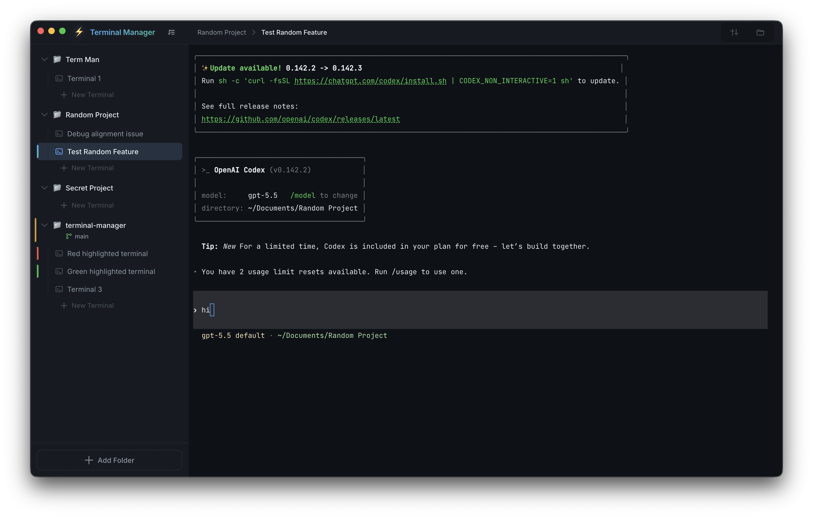

# Terminal Manager

A powerful open-source multi-terminal session manager desktop application built with Electron, xterm.js, and Monaco Editor. Designed to streamline developer workflows by providing a simple, efficient way to organize and run multiple concurrent command-line AI agents (such as Claude Code, Codex, Gemini, etc.) alongside standard shells. It groups terminal sessions by workspace, displays live git status/diffs, and provides a built-in file explorer.



---

## ⚡ Features

### 1. Workspace Session Management
- **Folder Grouping**: Add local folders to group related terminal tabs under a single workspace.
- **Custom Reordering**: Drag-and-drop support to manually reorder folders and terminal tabs in the sidebar.
- **Tag Colors**: Color-code individual folders or terminals to highlight active contexts.
- **Session Persistence**: Saves folder groups, tab order, and active settings to disk, allowing you to restore your workspace layout exactly after closing the app.

### 2. Smart Terminal Experience
- **PTY Spawning**: Backed by `node-pty` to spawn real login shells (`zsh` by default).
- **Zsh Integration**: Out-of-the-box shell integration (`ZDOTDIR` bootstrap scripts) that configures hooks for command capture without touching your personal `~/.zshrc`.
- **PTY Output Filter**: Custom parser that listens to OSC codes to track alternate screens and determine whether the terminal is at an active prompt.
- **Smart Autocomplete**: Ghost-text overlay suggestions inline with the terminal cursor based on your global command history.
- **Prefix History Search**: Cycle through matching historical commands using the Up/Down arrow keys.

### 3. Integrated Developer Utilities
- **Git Diff Viewer**: View local modified, deleted, renamed, or untracked changes side-by-side or inline using an embedded Monaco Diff Editor.
- **Project Files Browser**: Navigate project directories with a read-only files tree.
- **Monaco Code Previews**: Preview source code and markdown documents with syntax highlighting directly inside the app.

### 4. Claude Code Monitoring
- **Status Indicator**: Automatically monitors if a Claude Code agent process is running under any terminal session.
- **Session Resumer**: If you exit the app, it saves the session state. Upon reload, it writes a resume hint showing the command to resume your last Claude session (e.g., `claude --resume <session_id>`).
- **Model & Effort Switcher**: Status bar controls to toggle models (Opus, Sonnet, Haiku) and thinking effort level (Think, Ultrathink).

---

## 🛠️ Architecture

The project consists of three core components:
- **Main Process** (`main.js`): Spawns native pseudo-terminals, manages state saving/loading, watches Claude Code configurations, and bridges system-level operations.
- **Preload Script** (`preload.js`): Safely exposes system actions (PTY control, Git checks, directory tree reads) to the renderer process via `contextBridge`.
- **Renderer Process** (`renderer/`): Handles client-side view routing, renders components (Sidebar, TerminalManager, DiffViewer, ProjectFilesBrowser, ClaudeStatusBar), and manages styling/themes.

---

## 🚀 Getting Started

### Prerequisites
- Node.js (v18+)
- npm

### Installation
1. Clone the repository:
   ```bash
   git clone https://github.com/dshubham771/term-man.git
   cd term-man
   ```
2. Install dependencies:
   ```bash
   npm install
   ```

### Running Locally
To compile the esbuild bundle and start the Electron application:
```bash
npm start
```

### Running Tests
To execute the native Node.js test suites:
```bash
npm test
```

### Building & Packaging
To build production application packages for macOS:
```bash
# Full package (.dmg)
npm run dist

# Direct app bundle directory
npm run dist:dir
```

---

## 📄 License
This project is licensed under the MIT License - see the [package.json](package.json) file for details.
